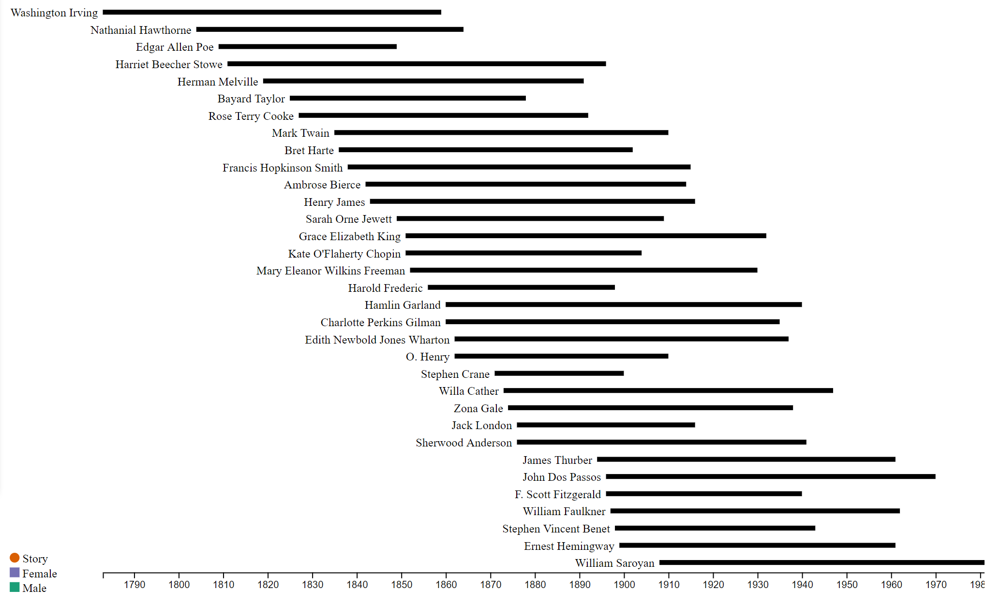
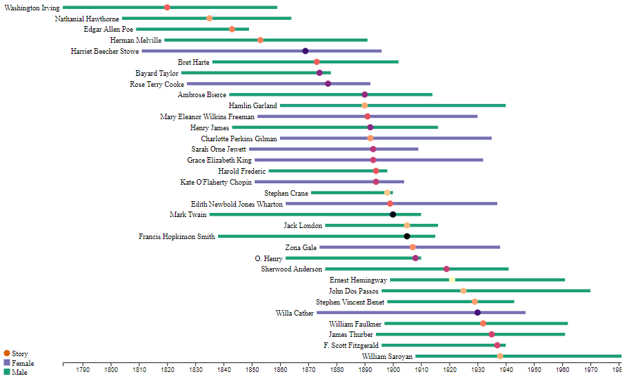

# Final Question

This is a question for the Spring 2021 final of Information Visualization. Included in this repository is a dataset and a starter html page. The html page already contains a D3 timeline visualization illustrating the lifespans of authors whose work was each showcased in a short story anthology.

### Starting Image

## Instructions

To receive credit for this question, you need to finish the following tasks:

1. The authors are currently sorted by their year of birth. Update the ordering so that, instead, the authors are ordered by the year of the story published in this anthology.
1. For each story by each author, create a circular mark along that author's timeline. It should be placed vertically in line with the author and in the correct horizontal position for the year of publication.
1. Add some color to the marks according to the legend already present on the page. Fill the male writers green and the female writers purple. The color for the circular mark should be based on the age of the writer at publication using a monotonically increasing color scale (e.g., magma).

### End Result
